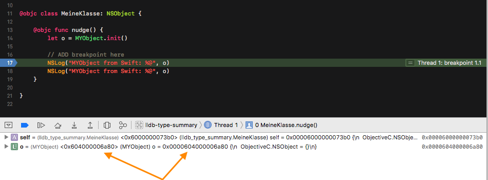
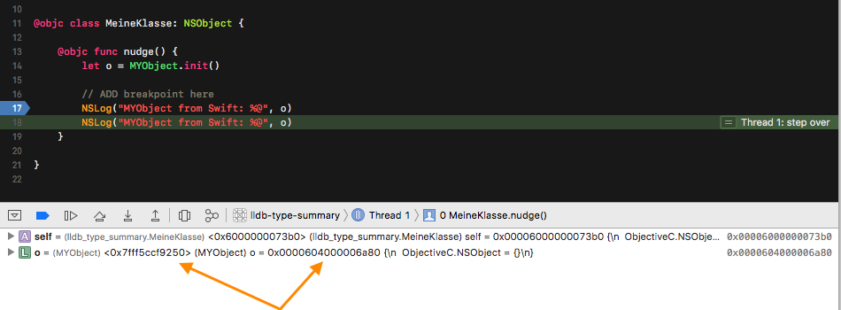

# Intention

More useful summaries in the Xcode debugger view for specific Objective-C objects using a python function for data formatting (as described in https://lldb.llvm.org/varformats.html), and calling methods on those objects.

# Issue

In a mixed Swift/ObjC project, this works perfectly fine in Objective-C code, but when looking at Swift frames that use any of those objects, it only works for one line after the initialization of the object, and fails for all subsequent ones. The reason for the failure seems to be that the `SBValue` that is to be summarised returns different values for the `GetAdress()` call. And the "other" value can't be used to call methods on the Obj-C object.

# Observations

* Works perfectly fine in Objc-C code (see screenshots [1](screenshots/objc-1.png) & [2](screenshots/objc-2.png))
* Putting the breakpoint on the second line immediatelly also shows the "unsuitable" address ([screenshot](screenshots/swift-2b.png))
* When using Xcode 9.3.1, the string representation of the `SBValue` differs (see screenshots [1](screenshots/swift-9.3.1-1.png) & [2](screenshots/swift-9.3.1-2.png))
* All other screenshots show Xcode 9.2
* Tested on Sierra (10.12.6, Xcode 9.2) & High Sierra (10.13.4, Xcode 9.3.1) -- issue exists on both
* The lldb summary code calling a method on the ObjC object can be run by uncommenting line 22 in the [lldb_summaries.py](lldb_summaries.py#L22) file